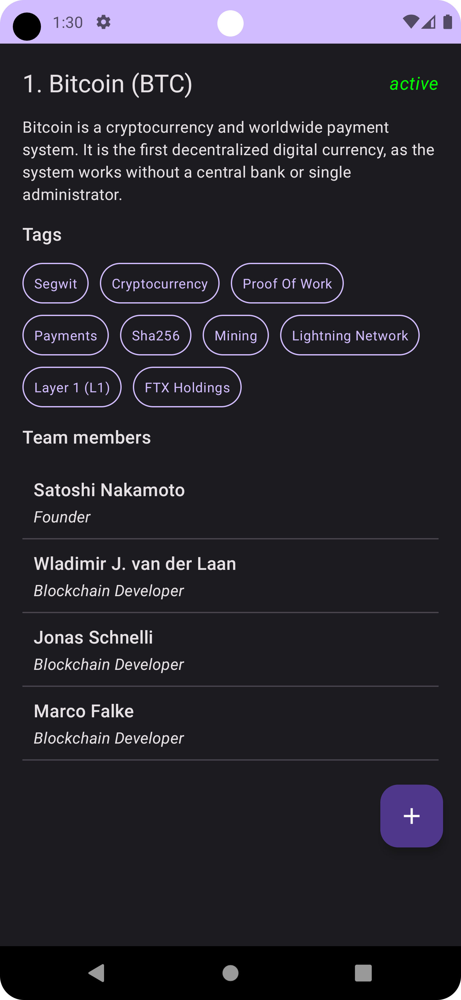

## Crypto Guide 💰
Crypto Guide is an Android application that fetches cryptocurrency data from [CoinPaprika](https://coinpaprika.com/) and displays a list of cryptocurrencies. 
The app allows users to view details of each cryptocurrency by selecting them from the list. 
It is built using Jetpack Compose and follows the MVVM architecture pattern, incorporating a UseCase layer for business logic.

## Features 🚀
- Cryptocurrency Listing: Browse a list of cryptocurrencies fetched from the CoinPaprika API.
- Cryptocurrency Details: View detailed information about each cryptocurrency.
- MVVM Architecture: The app follows the Model-View-ViewModel architecture pattern for clean separation of concerns.
- UseCase Layer: Business logic is encapsulated in use cases for better testability and modularity.

## Screenshots 📱
Below are some screenshots of the app:
<p align="center"> 
   
   
</p>

## Technologies and Libraries Used 🛠

- Jetpack Compose: For building the UI with declarative components.
- Retrofit: For making API requests to fetch cryptocurrency data.
- Coroutine Flow: For managing asynchronous data streams.
- Coil: For loading cryptocurrency images and icons.
- Dagger Hilt: For dependency injection.
- UseCase Pattern: To encapsulate business logic in the app.

## Architecture Details 🛠️
- MVVM Architecture:
  <br>
1- ViewModel: Handles UI state using Flow and exposes data to the UI.
  <br>
2- Repository: Fetches data from the CoinPaprika API and manages business logic through UseCases.


- UseCases: Each use case encapsulates a specific piece of business logic to keep the ViewModel clean and focused.
- Dependency Injection: Managed with Dagger Hilt for cleaner code and easier testing.

## Setup and Run

1- Clone the repository:
```bash
git clone https://github.com/your-username/crypto-guide.git
```
2- Open the project in Android Studio and run it on your device/emulator.

## Contributing
Feel free to contribute by:

- Forking the repository.
- Working on a new feature or bug fix.
- Submitting a pull request.
